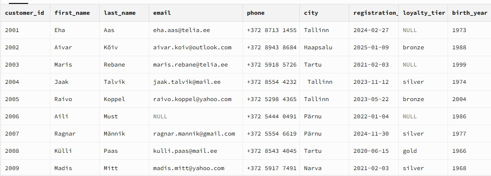

# Klientide arv kokku 
SELECT COUNT() AS klientide_arv FROM customers;  
  
3150 

# Andmete struktuur ülevaade
SELECT  *FROM customers LIMIT 10;    

# Nimekiri linnadest
-- (Unikaalsed, Suure algustähega, tühikuteta)  
SELECT DISTINCT INITCAP(TRIM(city)) AS city
FROM customers;  

Tulemus
Kliendi ostud linnadest 12 erinvat asukohta:  
  
Pärnu
Paide
Jõhvi
Tallinn
Narva
Võru
Viljandi
Rakvere
Haapsalu
Valga
Tartu
Kuressaare  

# Tallinna kliendid (15 tükki)

SELECT *
FROM customers
WHERE city = 'Tallinn'
ORDER BY last_name ASC
LIMIT 15;  

# Registeerimine 
 SELECT MIN(registration_date) AS vanim,           MAX(registration_date) AS uusim    FROM customers;
   `  
Vanim 2020-01-02  
Uusim 2025-02-27

# -- Puuduvate väärtuste kontroll

--eesnimedede kontroll  
SELECT COUNT(*) - COUNT(first_name) AS puuduvad_eesnimed    FROM customers;
0 Kõigil on olemas eesnimi  

--E-post kontroll
SELECT COUNT(*) - COUNT(email) AS puuduvad_emailid    FROM customers;    `
Tulemus 380 puuduvad e-maili  

# Lühike kokkuvõte:
! SQL Päringu tõõtavad ja on võimalik kasutada
 * Anmdestikku tuleb puhastada  
 * Erinevates formaatides:  -City  Linna nimeded  algavad väikese või suurte tähtedega,   
 * Mõned andmestikud on puudulikud: Kõikidel klientidel pole e-mail aadressi registeeritud.  
 * KAHLTUS Andmetes ESINEVAD  duplikaat entrid
 * 
# Järgmised sammud
* Duplikaatide tuvastamine  
  
SELECT COUNT() AS kokku_emaile,          COUNT(DISTINCT email) AS unikaalseid_emaile   FROM customers;   -- Vahe = duplikaadid!  
  
Kokku e-maile: 3150  
Kokku e-maile unikaalseid: 2640  
Vahe 510
  
# Klientide arv maakonniti:
``  
Puhastatud kujul:  
SELECT
    INITCAP(TRIM(city)) AS city,
    COUNT(*) AS klientide_arv
FROM customers
GROUP BY INITCAP(TRIM(city))
ORDER BY klientide_arv DESC;  

| Tallinn | Tartu | Pärnu | Narva | Viljandi | Rakvere | Kuressaare | Valga | Haapsalu | Jõhvi | Võru | Paide |
|---------|-------|-------|-------|----------|---------|-------------|-------|----------|-------|------|-------|
| 1238    | 658   | 346   | 177   | 112      | 107     | 98          | 94    | 90       | 83    | 81   | 66    |  

# Uued Kliendid - Viimase 6 kuu registeerimised 
SELECT  FROM customers   WHERE registration_date >= '2024-07-01'   ORDER BY registration_date DESC;   

👉 [Uuemad Kliendid ](https://github.com/silvervarusk/Sales-Analytics/blob/main/01_Sales_Analysis/uuemad_kliendid)  

