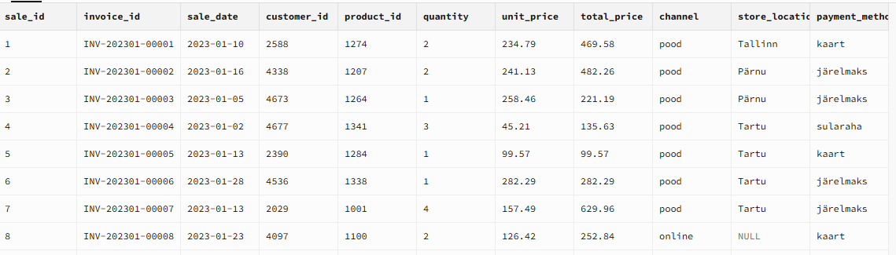

# 📊 WEEK 1 — Müügiosakond

---
## 🧱 Table view Andmestruktuuridest 

  

📊  Customers

  
  
  

  

  

📊 Sales  

  

  

📊 Products

  

## 🔍 Müük (A)
- Puuduvad kliendiandmed (Customer_ID): **1487 rida on null** - Poe ostud

  

  NULL väärtused ka = Epoe tehingud 

  

  

 Esineb loogikavigu (nt channel vs payment_method)

  

#### **❗Leidub nii väga suuri kui väga väikseid tehinguid (Negatiivse summaga)** + Duplikaadid

  

 Suuremad tehingud

  

 Negatiivsed tehingud

  

## 🔍 Kliendiandmed (B)

⚠️ **Andmete kvaliteet**

  

 - Linnanimed ebajärjekindlad (väike/suur algustäht)

  

  

 - Puuduvad e-mailid osadel klientidel  !!!! **Targeting AD VIP klienditdele PUUDULIK**

  

⚠️ **Duplikaadid ja null väärtused**
- Kokku e-maile: **3150**
- Unikaalseid: **2640**
- ❗ Vahemik **510**  Vajab täpsustamist mitu NUll Väärtust ja duplikaati.
  
  

  

 Duplikaat e-mailid 

  

## 🌍 Müügikanalid ja asukohad (D)

🛒 Müügikanalid: **online**, **pood**

💳 **Makseviisid:**
- järelmaks  
- kaart  
- sularaha  

⚠️ **Leitud probleem**
- 5204 tehingut ilma asukohata  (E-pood)

📍 ❗ E-poes on kasutatud *sularaha* → loogikaviga</strong>

 

 

📍 Linnad: <strong>Tallinn, Tartu, Pärnu, NULL</strong> — ❗ <strong>NULL väärtus = e-poe tellimus</strong>

 

## 🛍️ Tooteandmed (C)
| 👟 Jalanõud | 👶 Laste riided | 🎒 Aksessuaarid | 👗 Naiste riided | 👔 Meeste riided |
|------------|----------------|----------------|-----------------|-----------------|

---

# Kokkuvõte
## 🚨 Suurimad üllatused
🔴 **Müük**
- Ostud ei saa olla NEGATIIVSES summas kui tegemist ei ole tagastusega.
- Topelt maksed
- Esinevad null andmed  
 
🔴**Kliendiandmed**
  - Duplikaadid e-mailides → vajab puhastamist  

🔴**Müügikanalid ja asukohad**
  - Puuduvad NULL väärtused (hea kvaliteet)  
  - Channel vs payment mismatch  
  - e-poe maksed ≠ sularaha
   
---

## 💡 Soovitused Toomasele

- ✅ Standardiseerida linnanimed (LOWER / UPPER)  Kasutadaes INITCAP (capitalizes)  ja TRIM (Tühikute eemaldamiseks) funktsioone.
- Eemaldada e-mail duplikaadid ja topelt maksed
- Lisa validatsioon:
  - `online → ainult kaart/järelmaks`
- Kontrollida NULL asukohad ja võimalused korrigeerida
- Kontrollida üle negatiivsed maksed  
   
**Järeldus**
Tabelid sisaldavad piisavalt andmeid analüüsiks,  
kuid vajab **andmete puhastamist ja valideerimist*. enne kui saab juhtkonnale edasi anda.

## 🔗 SQL & Audit Logid 
  
  

* Roll A Müügiandmed  

  👉[Müük](https://github.com/silvervarusk/Sales-Analytics/blob/main/01_Sales_Analysis/Roll%20A%20m%C3%BC%C3%BCk.md)  
  
* Roll B Kliendiandmed (customers)  
  
  👉 [Kliendiandmed](https://github.com/silvervarusk/Sales-Analytics/blob/main/01_Sales_Analysis/Kliendiandmed%20SQL%20päringud.md)  

* Roll C  Tooteandmed (products)

  👉 [Tooteandmed](https://github.com/silvervarusk/Sales-Analytics/blob/main/01_Sales_Analysis/Roll%20C%20Tooteandmed.md)  
 
* ROll D  Müügikanalid (sales: kanalid, asukohad  
  
  👉[Müügikanalid ja asukohad](https://github.com/silvervarusk/Sales-Analytics/blob/main/01_Sales_Analysis/myygikanalid%20ja%20asukohad.md)  

 * Lisa  
   👉 [SQL Week 01 – Andmete import](https://github.com/silvervarusk/Sales-Analytics/blob/main/01_Sales_Analysis/SQL%20WEEK%2001%20CODE%20andmete%20import)
   
   👉 [Uuemad Kliendid viimased 6 kuud ](https://github.com/silvervarusk/Sales-Analytics/blob/main/01_Sales_Analysis/uuemad_kliendid)
   

## 📚 Kasutatud materjalid

- N1_0_1_P_IT_SQL_pohi_v2.9  
- N1_2_1_P_GT_SQL_pohi_v2.9

