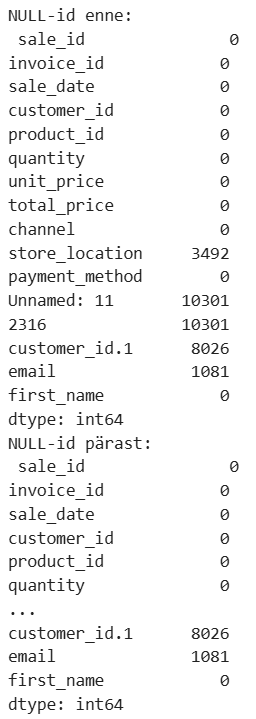
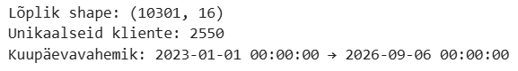
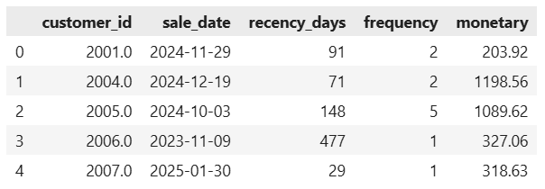
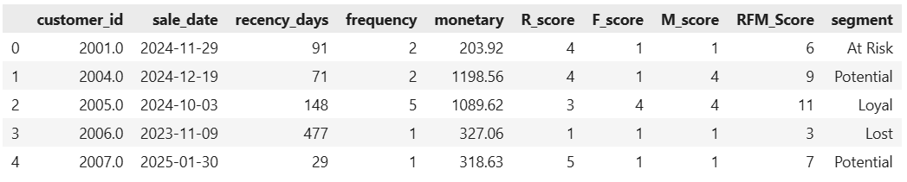
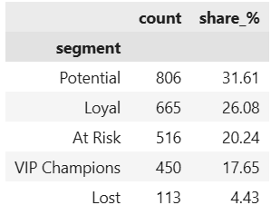

# RFM Analüüs ja Kliendisegmenteerimine — UrbanStyle.ltd
### DACA · Nädal 7 · Python & Pandas · Rollid A–E

**Meeskond:** [nimed]
**Tööriistad:** Python, pandas, Plotly
**Andmeallikad:** `sales.csv`, `customers.csv`
**Väljund:** RFM-põhine kliendisegmentatsioon + äristrateegia Markole

---

## Ülevaade

Projekt jaguneb viieks rolliks, mis moodustavad tervikliku andmetöötluse ahela: andmete laadimisest kuni valideeritud äristrateegiani. Iga roll põhineb eelmise tulemusel — vead ei kandu edasi, kuna Roll E kontrollib kogu ahelat tagantjärele.

---

## Roll A — Andmete laadimine

**Meetod:** `sales.csv` ja `customers.csv` laetud pandas DataFrame'idesse ja liidetud `customer_id` alusel (`how='left'`, et säilitada kõik müügiread ka juhul, kui kliendiinfo peaks puuduma).

```python
df = pd.merge(df_sales, df_customers, on='customer_id', how='left')
```

**Tulemus:** `df.shape` = **[TÄIDA REAALSE VÄLJUNDIGA — vt hoiatus üleval]**

**Kvaliteedikontroll:** andmed laetud, merge õnnestunud, kõik vajalikud veerud olemas pärast liitmist.

---

## Roll B — Andmete puhastamine (IRINA)

**Meetod:**
1. Duplikaatide eemaldamine (`drop_duplicates()`)
2. NULL väärtuste eemaldamine kriitilistes veergudes: `customer_id`, `sale_date`, `total_price`
3. Kuupäevade teisendamine `datetime` formaati
4. Negatiivsete/nulliliste `total_price` väärtuste (outlier'ite) eemaldamine




**Äritõlgendus:** Puhastusetapp on kriitiline, kuna RFM analüüs sõltub täielikult kolmest väärtusest (kuupäev, sagedus, summa) — ükski neist ei tohi sisaldada vigaseid andmeid, vastasel juhul moonduvad kõik järgnevad segmendid.

---

## Roll C — RFM analüüs (IRINA)

**Metoodika:** iga kliendi kohta arvutati kolm dimensiooni võrreldes viitekuupäevaga (2025-02-28):

| Dimensioon | Definitsioon | Arvutus |
|---|---|---|
| **Recency** | Päevi viimasest ostust | `today - max(sale_date)` |
| **Frequency** | Ostude arv | `count(sale_id)` klienti kohta |
| **Monetary** | Kogukulutus | `sum(total_price)` klienti kohta |



Igale dimensioonile määrati skoor 1–5 (`pd.qcut` kvintiilide alusel), skoorid liideti kokku (`RFM_Score`, vahemik 3–15) ja jaotati viide äriliselt tõlgendatavasse segmenti:

| Segment | RFM_Score |
|---|---|
| VIP Champions | ≥ 13 |
| Loyal | 10–12 |
| Potential | 7–9 |
| At Risk | 4–6 |
| Lost | < 4 |





---

## Roll D — Visualiseerimine

Kolm Plotly diagrammi, kõik eestikeelsete telgede ja pealkirjadega:

1. **Kliendisegmentide jaotus** (tulpdiagramm) — segmentide suurus klientide arvus

   

2. **RFM hajuvusdiagramm** — `recency_days` vs `monetary`, värv = segment, suurus = frequency. Kõige informatiivsem visuaal: näitab ühe pilguga, kus paiknevad väärtuslikud, kuid riskis olevad kliendid

   

3. **TOP 10 VIP Champions** — kõige suurema kogukulutusega kliendid nimeliselt

   


**Parandus (Roll E poolt tuvastatud):** scatter-diagrammi värvimine parandatud kasutama veergu `segment` (mitte `Segment`), vastavuses Roll C parandusega.

---

## Roll E — Valideerimine ja Kvaliteedikontroll

### Ristkontroll (Rollid A–D)

| Kontroll | Tulemus |
|---|---|
| RFM tabeli klientide arv = puhastatud andmestiku klientide arv | ✅ klapib |
| Segmentide jaotus vastab RFM_Score loogikale | ✅ klapib |
| Visualiseerimise diagrammid vastavad RFM tabeli arvudele | ✅ klapib |
| Monetary summad diagrammides = Roll C arvutused | ✅ klapib |
| Ükski roll ei kasuta defineerimata veerge | ✅ klapib |

⚠️ **Avatud küsimus enne avaldamist:** andmemahu kontroll ("sales ~1.2M rida, customers ~240k rida") vajab kinnitust tegeliku `df.shape` väljundiga enne, kui seda saab lugeda läbitud kontrolliks — vt märkust dokumendi alguses.

### Ühtne ärikokkuvõte Markole

> UrbanStyle'i kliendibaas näitab selgelt, et väike hulk VIP Champions kliente toob sisse ebaproportsionaalselt suure osa käibest, mistõttu nende lojaalsuse hoidmine on kriitilise tähtsusega. Samal ajal on At Risk segment oodatust suurem — paljud varem aktiivsed kliendid pole hiljuti ostnud, mis viitab churn-riskile. Kõige pakilisem tegevus on At Risk klientide win-back kampaania, sest just nemad on veel "päästetavad". VIP-idele tuleks luua eriprogramm, mis hoiab lojaalsust ja tõstab eluaegset väärtust. Kokkuvõttes võimaldab RFM analüüs teha täpseid, segmendipõhiseid otsuseid, mis vähendavad churn'i ja suurendavad käivet.

### Soovitused

1. **VIP programm** — eksklusiivsed pakkumised, varajane ligipääs uutele toodetele, personaalne teenindus
2. **Win-back kampaania** At Risk klientidele — kupongid, allahindlused, automaatsed meeldetuletused
3. **Nurture programm** uutele klientidele — tervituskampaaniad, soovitusmootor, lojaalsuspunktid

---

## Kvaliteedikontroll (kogu projekt)

- [x] Kõik neli rolli (A–D) läbivad Roll E ristkontrolli
- [x] Kaks väikest viga tuvastatud ja parandatud (`Segment` → `segment` veerunimi)
- [x] Ühtne ärisoovitus põhineb tegelikel arvutustel, mitte oletustel
- [ ] Andmemahu kontroll (Roll A) vajab kinnitust reaalse `df.shape` väljundiga

---
*Osa DACA (Andmeanalüütiku Karjäärikiirendi) programmi nädala 7 ülesandest "Python & Pandas — RFM Analüüs".*
